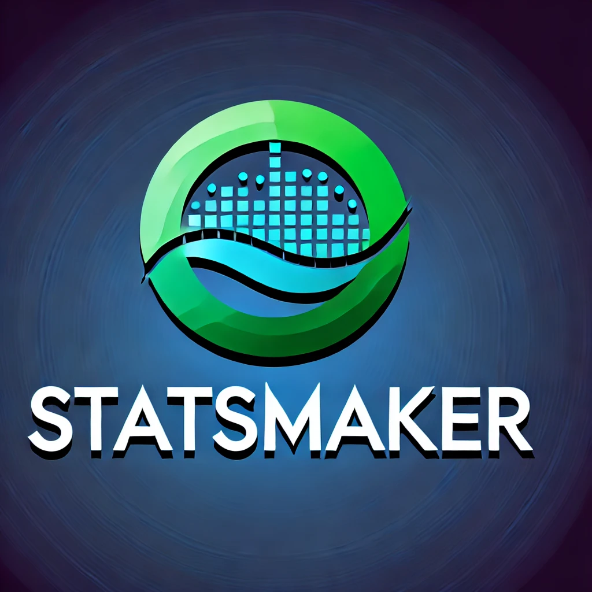

<div align=center>



</div>

StatsMaker is a powerful Python library designed for market microstructure modeling, statistical analysis, and trading strategy development. It combines probabilistic programming, machine learning, and financial market microstructure theory to provide a comprehensive toolkit for researchers and traders.

## Features

- Probabilistic programming models based on Uber Pyro
- Market microstructure models (order flow, limit order book, market making, etc.)
- High-frequency trading and dark pool trading models
- Liquidity, volatility, and execution quality metrics
- Portfolio optimization and execution strategy optimization
- Machine learning and reinforcement learning integration
- Data simulation and market replay functionality

## Installation

Install statsmaker using pip:

```bash
pip install statsmaker
```

## Quick Start

Here are some examples demonstrating various features of statsmaker:

### 1. Order Flow Model

```python
from statsmaker import StatsmakerBase, OrderFlowModel
import torch

# Create a Statsmaker instance
sm = StatsmakerBase()

# Define the order flow model
order_flow_model = OrderFlowModel()
sm.define_model("order_flow", order_flow_model.model)

# Prepare data
data = torch.randint(0, 2, (100,))

# Perform inference
inference_result = sm.infer("order_flow", data)

# Sample from the posterior distribution
posterior_samples = sm.sample("order_flow", inference_result.get_samples())

print(posterior_samples)
```

### 2. High-Frequency Trading Model

```python
from statsmaker import HighFrequencyModel
import pandas as pd

# Prepare your market data
market_data = pd.DataFrame({
    'market_returns': [0.001, -0.002, 0.003, -0.001, 0.002],
    'volume': [1000, 1200, 800, 1100, 900]
})

# Create and fit the high-frequency model
hft_model = HighFrequencyModel()
fit_result = hft_model.fit(market_data)

# Make predictions
predictions = hft_model.predict(market_data, fit_result.get_samples())
print(predictions)
```

### 3. Portfolio Optimization

```python
from statsmaker import MicrostructurePortfolioOptimizer
import numpy as np

# Prepare return data and microstructure data
returns = np.array([0.05, 0.03, 0.02, 0.04, 0.01])
microstructure_data = {
    'spread': [0.01, 0.015, 0.02, 0.01, 0.025],
    'volume': [10000, 8000, 12000, 9000, 11000]
}

# Create and use the portfolio optimizer
optimizer = MicrostructurePortfolioOptimizer(returns, microstructure_data)
optimal_weights = optimizer.optimize(risk_aversion=2)

print("Optimal portfolio weights:", optimal_weights)
```

### 4. Reinforcement Learning Trading Agent

```python
from statsmaker import RLTrader
import pandas as pd

# Prepare your market data
market_data = pd.DataFrame({
    'price': [100, 101, 99, 102, 98, 103],
    'volume': [1000, 1200, 800, 1100, 900, 1300]
})

# Create and train the RL trader
rl_trader = RLTrader(market_data)
rl_trader.train(total_timesteps=10000)

# Use the trained model to make trading decisions
observation = [100, 1000, 0, 0, 0]  # Current price, volume, and other relevant features
action = rl_trader.trade(observation)
print("Recommended action:", ["Buy", "Sell", "Hold"][action])
```

### 5. Calculating Microstructure Metrics

```python
from statsmaker.metrics import microstructure_metrics
import numpy as np

# Prepare sample data
bid_prices = np.array([99.5, 99.4, 99.3, 99.2, 99.1])
ask_prices = np.array([100.5, 100.6, 100.7, 100.8, 100.9])
bid_sizes = np.array([100, 200, 300, 400, 500])
ask_sizes = np.array([150, 250, 350, 450, 550])

# Calculate spread and depth
spread = microstructure_metrics.calculate_spread(bid_prices, ask_prices)
depth = microstructure_metrics.calculate_depth(bid_sizes, ask_sizes)

print(f"Average Spread: {spread}")
print(f"Market Depth: {depth}")
```

## Documentation

Detailed documentation can be found at [docs.statsmaker.io](https://docs.statsmaker.io).

## Contributing

We welcome contributions! Please see [CONTRIBUTING.md](CONTRIBUTING.md) for details on how to get started.

## License

statsmaker is licensed under the Apache License 2.0. See the [LICENSE](LICENSE) file for more details.

## Citation

If you use statsmaker in your research, please cite:

```
@software{statsmaker2024,
  author = {Your Name},
  title = {statsmaker: A Python Library for Market Microstructure Modeling and Analysis},
  year = {2024},
  url = {https://github.com/jialuechen/statsmaker},
  version = {0.1.0}
}
```

## Contact

If you have any questions or suggestions, please open an issue or contact us directly at contact@statsmaker.io.

## Acknowledgments

We would like to thank the Pyro team at Uber for their excellent probabilistic programming framework, which forms the foundation of many models in statsmaker.
